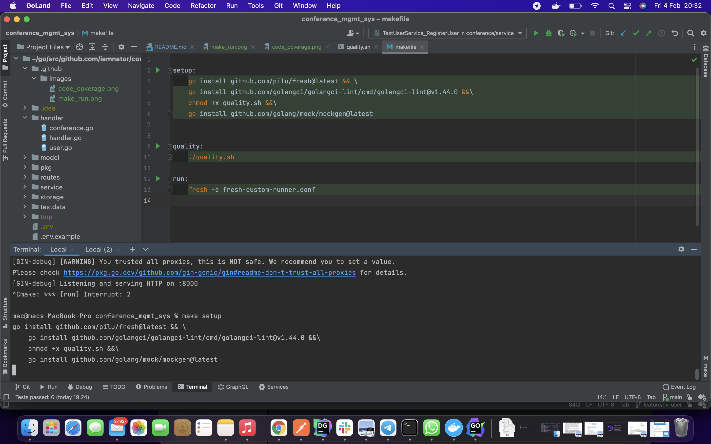
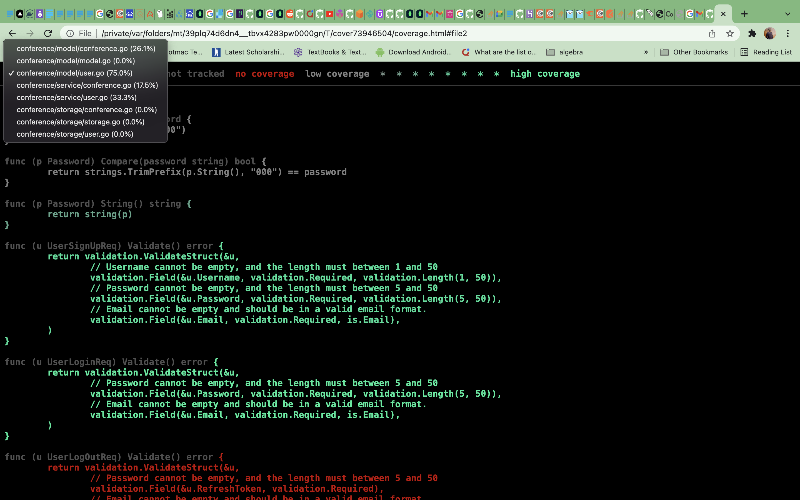
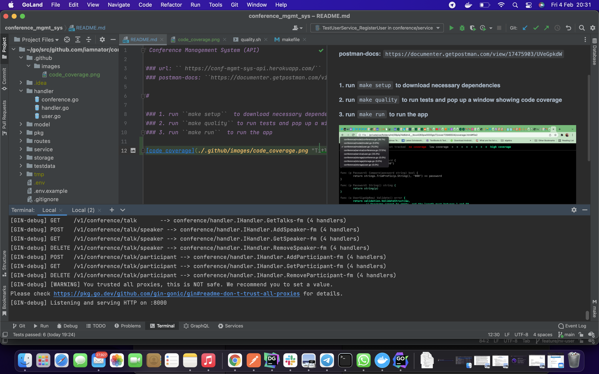

# Conference Management System (API)

#### url: `` https://conf-mgmt-sys-api.herokuapp.com/``  
#### postman-docs: ``https://documenter.getpostman.com/view/17475903/UVeGpkdW``

##

#### 1. run ``make setup``  to download necessary dependencies

##
#### 2. run ``make quality`` to run tests and pop up a window showing code coverage

##

#### 3. run ``make run``  to run the app

